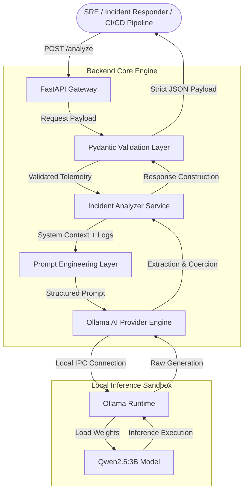
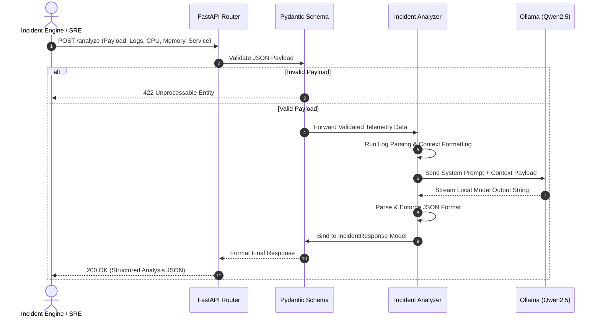

<div align="center">

# 🚀 AI DevOps Copilot

### *Local, Air-Gapped AI Incident Analysis & Root Cause Identification Platform*

  <p align="center">
    An AI-powered incident analysis platform built with FastAPI and Ollama that helps DevOps Engineers and Site Reliability Engineers analyze application logs and infrastructure metrics using a locally running Large Language Model.
  </p>

  <p align="center">
    <a href="https://python.org"></a>
    <a href="https://fastapi.tiangolo.com"></a>
    <a href="https://ollama.ai"></a>
    <a href="https://pydantic.dev"></a>
    <a href="LICENSE"></a>
    <a href="https://github.com/rahman5828/ai-devops-copilot/pulls"></a>
  </p>

  <p align="center">
    <a href="#-key-features">Features</a> •
    <a href="#-architecture">Architecture</a> •
    <a href="#-quick-start">Quick Start</a> •
    <a href="#-api-reference">API Reference</a> •
    <a href="#-roadmap">Roadmap</a> •
    <a href="#-contributing">Contributing</a>
  </p>

---

</div>

> 🔒 **100% Privacy & Zero Data Egress**: Operating strictly on local infrastructure using `Qwen2.5:3B` via `Ollama`. No third-party API keys required, no external data transmission, fully compliant with strict air-gapped security policies.

---

## 🚧 Project Status

**Current Version:** `v0.1.0`  
**Status:** Active Development (MVP)

This project is currently in its initial MVP phase and serves as a foundation for future AI DevOps capabilities. New features and integrations will be introduced incrementally through versioned releases.

---

## 📌 Executive Summary

Modern cloud systems generate large volumes of logs and metrics during outage events. When an incident occurs, Site Reliability Engineers (SREs) and DevOps responders often need to manually parse log traces and correlate them with basic metrics to understand what failed.

**AI DevOps Copilot** is an open-source AI-powered incident analysis platform built with FastAPI and Ollama. It helps DevOps Engineers and Site Reliability Engineers analyze application logs and infrastructure metrics using a locally running Large Language Model. The system ingests service logs and telemetry metrics to return structured JSON reports containing severity classification, root cause summaries, and actionable recommendations.

```
       [Raw Logs + CPU/RAM Metrics]
                    │
                    ▼
    ┌──────────────────────────────┐
    │      AI DevOps Copilot       │
    │  - Pydantic Validation Layer │
    │  - Local Qwen2.5:3B Engine   │
    └──────────────────────────────┘
                    │
                    ▼
       [Structured JSON: RCA + Steps]
```

---

## ✨ Key Features

| Feature | Description |
| :--- | :--- |
| **🤖 Local LLM Inference** | Powered locally by `Ollama` running `Qwen2.5:3B`. Zero API costs and private local processing. |
| **⚡ FastAPI Gateway** | Asynchronous API layer built on **FastAPI** using Python 3.13. |
| **🎯 Structured JSON Output** | Enforces consistent response schemas using `Pydantic v2` for easier integration with downstream tools. |
| **📦 Modern Package Management** | Uses `uv` for fast workspace environment syncing and dependency management. |
| **📖 Self-Documenting OpenAPI** | Interactive Swagger UI docs pre-configured at `/docs`. |
| **🧱 Modular Architecture** | Modular project structure separating routing, schemas, AI providers, and services. |

---

## 🏗 Architecture

The platform separates data ingestion, validation, prompt generation, local inference execution, and schema validation into distinct components.



---

## 🔄 Workflow Lifecycle

The execution trace from telemetry payload receipt to output validation:



---

## 📁 Repository Structure

```
backend/
├── app/
│   ├── ai/                      # AI Engine Modules
│   │   ├── ollama_client.py     # Low-level Async Ollama API Client
│   │   ├── provider.py          # AI Abstract Provider Wrappers
│   │   └── prompts.py           # System Prompts & Instruction Engineering
│   │
│   ├── api/                     # REST API Endpoints
│   │   └── routes/
│   │       └── incident.py      # Incident Analysis Endpoints
│   │
│   ├── schemas/                 # Pydantic Schemas & Data Contracts
│   │   ├── incident_request.py  # Ingestion Data Model
│   │   └── incident_response.py # Output Structured Data Model
│   │
│   ├── services/                # Core Business Logic
│   │   └── analyzer.py          # Root Cause & Incident Processing Unit
│   │
│   └── utils/                   # Utilities & Helpers
│       └── log_parser.py        # Log Preprocessing & Normalization Tools
│
└── sample-logs/                 # Test Log Artifacts for Analysis
    ├── redis-failure.log
    ├── memory-leak.log
    └── postgres-deadlock.log
```

---

## 🛠 Tech Stack

| Technology | Domain | Purpose |
| :--- | :--- | :--- |
| **Python 3.13** | Runtime Environment | Core backend language runtime |
| **FastAPI** | Web Framework | Web API framework for REST endpoints |
| **Uvicorn** | ASGI Server | Asynchronous server implementation |
| **Pydantic v2** | Data Validation | Request and response schema validation |
| **Ollama** | Local LLM Engine | Local model runtime runner |
| **Qwen2.5:3B** | Foundation Model | Open-weights language model used for local inference |
| **uv** | Package Management | Fast Python package and environment manager |

---

## ⚡ Quick Start

### Prerequisites

- **Python 3.13+** installed locally
- **uv** package manager installed (`pip install uv` or `curl -LsSf https://astral.sh/uv/install.sh | sh`)
- **Ollama** runtime installed ([https://ollama.ai/download](https://ollama.ai/download))

### Step-by-Step Installation

1. **Clone the repository**:
   ```bash
   git clone https://github.com/rahman5828/ai-devops-copilot.git
   cd ai-devops-copilot
   ```

2. **Synchronize environment with `uv`**:
   ```bash
   uv sync
   ```

3. **Pull and serve the local Qwen model**:
   ```bash
   # Pull the local language model
   ollama pull qwen2.5:3b

   # Ensure the local daemon is running
   ollama serve
   ```

4. **Launch the API Gateway**:
   ```bash
   uv run uvicorn app.main:app --reload --host 127.0.0.1 --port 8000
   ```

5. **Verify API availability**:
   Access the interactive Swagger API docs at [http://127.0.0.1:8000/docs](http://127.0.0.1:8000/docs).

---

## 🎬 Demo

### Swagger Interactive Documentation
Once running locally, interactive documentation is available at:
`http://127.0.0.1:8000/docs`

### Example Request
```json
POST /analyze
{
  "service": "payment-service",
  "logs": "Redis connection refused",
  "cpu": 95,
  "memory": 88
}
```

### Example Response
```json
{
  "severity": "high",
  "summary": "Payment Service Performance Issues Detected",
  "root_cause": "Redis connectivity failure",
  "recommendations": [
    "Investigate Redis",
    "Monitor CPU",
    "Scale the service"
  ]
}
```

---

## 📖 API Documentation & Examples

### Endpoint: `POST /analyze`

Ingests log data alongside resource usage metrics to generate a structured analysis report.

#### Request Headers
```http
Content-Type: application/json
```

#### Request Payload Schema
```json
{
  "service": "string",
  "logs": "string",
  "cpu": "number (percentage 0-100)",
  "memory": "number (percentage 0-100)"
}
```

---

### Real-World Incident Case Study

#### 1. Ingestion Request

```bash
curl -X 'POST' \
  'http://127.0.0.1:8000/analyze' \
  -H 'accept: application/json' \
  -H 'Content-Type: application/json' \
  -d '{
  "service": "payment-service",
  "logs": "2026-07-24T14:22:01Z [ERROR] Connection pool exhausted. Failed to connect to Redis instance at 10.0.4.12:6379: Connection refused.",
  "cpu": 95,
  "memory": 88
}'
```

#### 2. AI Copilot Structured Response

```json
{
  "severity": "high",
  "summary": "Payment Service Performance Issues Detected",
  "root_cause": "Redis connectivity failure",
  "recommendations": [
    "Investigate Redis service status and network connectivity on port 6379",
    "Monitor CPU utilization on the payment-service host to ensure threadpool stability",
    "Scale the payment-service deployment horizontally if connection pool starvation persists"
  ]
}
```

---

## 🎯 Roadmap

The planned release milestones for extending the core platform capabilities:

- [x] **v0.1.0** — Core FastAPI Backend, Ollama Driver Integration & Qwen2.5 Schema Validation
- [ ] **v0.2.0** — **Smart Log Parser**: Basic log preprocessing, filtering, and normalization
- [ ] **v0.3.0** — **File Upload Analysis**: Support for submitting log files directly via API endpoints
- [ ] **v0.4.0** — **Docker Log Analysis**: Integration helpers for analyzing container log outputs
- [ ] **v0.5.0** — **Kubernetes Analysis**: Diagnosis assistance for basic Kubernetes cluster/pod errors
- [ ] **v0.6.0** — **Prometheus Metrics**: Ingestion support for basic Prometheus metric queries
- [ ] **v0.7.0** — **AI Chat Assistant**: Conversational endpoint for interacting with incident context
- [ ] **v1.0.0** — **Complete AI DevOps Copilot Platform**: Initial stable platform release combining core features

---

## 🤝 Contributing

Contributions are welcome to help grow this project.

1. **Fork the Project**
2. **Create your Feature Branch** (`git checkout -b feature/AmazingFeature`)
3. **Commit your Changes** (`git commit -m 'Add some AmazingFeature'`)
4. **Push to the Branch** (`git push origin feature/AmazingFeature`)
5. **Open a Pull Request**

Please ensure your pull requests follow clean code practices and pass existing tests before submission.

---

## 🔮 Future Vision

Future releases aim to expand the capability of this initial MVP into a broader assistant for DevOps workflows. Planned future concepts include:

```
                  ┌───────────────────────────────────────────────┐
                  │       AI DevOps Copilot Future Scope         │
                  └───────────────────────┬───────────────────────┘
                                          │
       ┌──────────────────┬───────────────┼───────────────┬──────────────────┐
       ▼                  ▼               ▼               ▼                  ▼
┌──────────────┐   ┌────────────┐  ┌─────────────┐  ┌────────────┐   ┌──────────────┐
│  Kubernetes  │   │   Docker   │  │ Prometheus  │  │ Incident   │   │ Interactive  │
│ Troubleshoot │   │ Log Analysis│ │ Metrics RCA │  │ Timelines  │   │ Chat Systems │
└──────────────┘   └────────────┘  └─────────────┘  └────────────┘   └──────────────┘
```

Future releases aim to include:

- **Kubernetes Troubleshooting**: Context-aware helpers for diagnosing common pod and deployment failures.
- **Docker Log Analysis**: Automated parsing of container logs directly from local Docker environments.
- **Prometheus Metric Analysis**: Ingesting time-series metrics to help correlate resource spikes with error logs.
- **Root Cause Analysis & Timelines**: Generating basic chronological post-incident summaries.
- **Interactive AI Chat & Recommendations**: Allowing engineers to query incident details through a natural language interface locally.

---

## 📄 License

Distributed under the **MIT License**. See [`LICENSE`](LICENSE) for more information.

---

## 👤 Author

**Abdul Rahman V A**

* GitHub: [@rahman5828](https://github.com/rahman5828)
* LinkedIn: [rahmanva](https://linkedin.com/in/rahmanva)

---

<div align="center">

⭐ **If you find this project useful, consider giving it a star on GitHub!** ⭐

</div>
